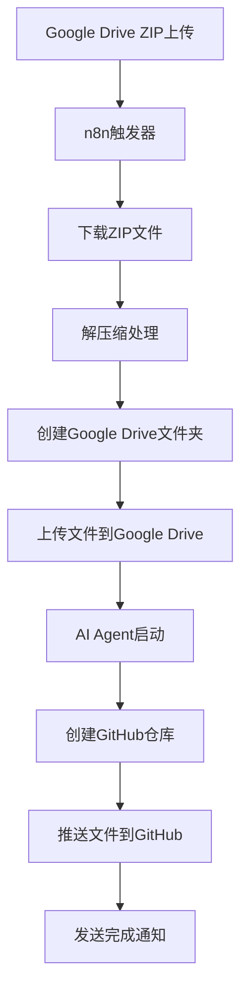

# n8n ZIP to GitHub 自动化工作流

这是一个基于n8n的自动化工作流系统，能够监听Google Drive中的ZIP文件上传，自动解压缩并推送到GitHub仓库。

## 🎯 功能概述

当你将ZIP文件上传到指定的Google Drive文件夹时，系统会自动：

1. **监听文件上传** - 检测到新的ZIP文件
2. **下载并解压** - 自动下载ZIP文件并解压缩
3. **上传到Google Drive** - 将解压后的文件夹上传到指定位置
4. **创建GitHub仓库** - 使用AI Agent创建新的GitHub仓库
5. **推送代码** - 将所有文件推送到新创建的GitHub仓库
6. **发送通知** - 完成后发送邮件通知

## 🏗️ 架构设计



## 📁 项目结构

```
n8n-zip-to-github-workflow/
├── README.md                   # 项目说明文档
├── src/
│   ├── unzip-code.js          # ZIP解压缩处理代码
│   └── github-agent.js        # AI Agent GitHub集成代码
├── configs/
│   └── n8n-workflow.json      # n8n工作流配置文件
├── docs/
│   ├── setup-guide.md         # 详细配置指南
│   └── api-documentation.md   # API文档
├── .env.example               # 环境变量示例
├── package.json              # 依赖配置
└── LICENSE                   # MIT许可证
```

## 🚀 快速开始

### 1. 环境准备

确保你已经安装并配置了以下服务：

- **n8n** - 工作流自动化平台
- **Google Drive API** - 文件存储和监听
- **GitHub API** - 代码仓库管理
- **AI Agent服务** - 智能处理引擎

### 2. 配置环境变量

复制 `.env.example` 文件并重命名为 `.env`，然后填入你的配置信息：

```bash
GITHUB_TOKEN=your_github_personal_access_token
GITHUB_OWNER=your_github_username
MCP_SERVER_URL=your_mcp_server_endpoint
GOOGLE_DRIVE_FOLDER_ID=target_folder_id
N8N_WEBHOOK_URL=your_n8n_webhook_url
```

### 3. 导入n8n工作流

1. 打开n8n管理界面
2. 创建新的工作流
3. 导入 `configs/n8n-workflow.json` 文件
4. 配置各节点的认证信息
5. 激活工作流

### 4. 测试工作流

1. 将一个ZIP文件上传到指定的Google Drive文件夹
2. 观察n8n工作流的执行过程
3. 检查生成的GitHub仓库
4. 验证所有文件是否正确上传

## 🔧 核心组件

### ZIP解压缩处理器

位于 `src/unzip-code.js`，负责：
- 下载ZIP文件
- 解析文件结构
- 提取所有文件内容
- 生成文件夹结构信息

### AI Agent GitHub集成

位于 `src/github-agent.js`，提供：
- 自动创建GitHub仓库
- 批量文件上传
- 错误处理和重试机制
- 操作结果统计

### n8n工作流配置

位于 `configs/n8n-workflow.json`，包含：
- 完整的节点配置
- 数据流连接关系
- 错误处理逻辑
- 通知机制

## 📋 使用场景

这个工作流特别适用于：

- **代码项目管理** - 快速将本地项目推送到GitHub
- **文档归档** - 自动化文档处理和版本控制
- **团队协作** - 简化文件分享和代码仓库创建流程
- **备份恢复** - 定期备份重要文件到Git仓库
- **CI/CD集成** - 作为持续集成流程的一部分

## ⚙️ 高级配置

### 文件过滤

可以在工作流中添加文件类型过滤器：

```javascript
// 只处理特定类型的ZIP文件
const allowedTypes = ['.zip', '.rar', '.7z'];
const fileExtension = fileName.toLowerCase().substring(fileName.lastIndexOf('.'));

if (!allowedTypes.includes(fileExtension)) {
    throw new Error(`不支持的文件类型: ${fileExtension}`);
}
```

### 自定义命名规则

```javascript
// 生成带时间戳的仓库名
const timestamp = new Date().toISOString().slice(0, 10);
const repoName = `${folderName}-${timestamp}`;
```

### 批量处理优化

```javascript
// 并发处理多个文件
const concurrencyLimit = 5;
const chunks = _.chunk(files, concurrencyLimit);

for (const chunk of chunks) {
    await Promise.all(chunk.map(file => uploadFile(file)));
}
```

## 🛡️ 安全考虑

- 使用n8n的凭据管理器存储所有敏感信息
- 定期轮换API tokens和访问密钥
- 限制GitHub仓库的访问权限
- 验证上传文件的内容和格式
- 启用审计日志记录

## 🔍 故障排除

### 常见问题

1. **ZIP文件解压失败**
   - 检查文件大小是否超过n8n限制
   - 验证ZIP文件是否损坏
   - 确认有足够的临时存储空间

2. **GitHub API调用失败**
   - 验证Personal Access Token是否有效
   - 检查API速率限制
   - 确认仓库名称是否符合GitHub规范

3. **Google Drive权限问题**
   - 确认OAuth2认证是否正确配置
   - 检查Drive API是否已启用
   - 验证文件夹访问权限

### 调试模式

在n8n中启用详细日志记录：

```javascript
console.log('调试信息:', {
    fileName: file.name,
    fileSize: file.size,
    timestamp: new Date().toISOString()
});
```

## 📈 性能优化

- **并发处理**: 使用Promise.all()并发上传多个文件
- **分块上传**: 对大文件进行分块处理
- **缓存机制**: 避免重复处理相同文件
- **队列管理**: 使用n8n的队列模式处理大量任务

## 🤝 贡献指南

欢迎提交Issue和Pull Request！请确保：

1. 代码符合项目编码规范
2. 添加必要的测试用例
3. 更新相关文档
4. 详细描述变更内容

## 📄 许可证

MIT License - 详见 [LICENSE](LICENSE) 文件

## 🙏 致谢

感谢以下开源项目的支持：
- [n8n](https://n8n.io/) - 工作流自动化平台
- [JSZip](https://stuk.github.io/jszip/) - JavaScript ZIP库
- [Google Drive API](https://developers.google.com/drive) - 云存储服务
- [GitHub API](https://docs.github.com/en/rest) - 代码托管平台

---

如有问题或建议，请提交Issue或联系项目维护者。